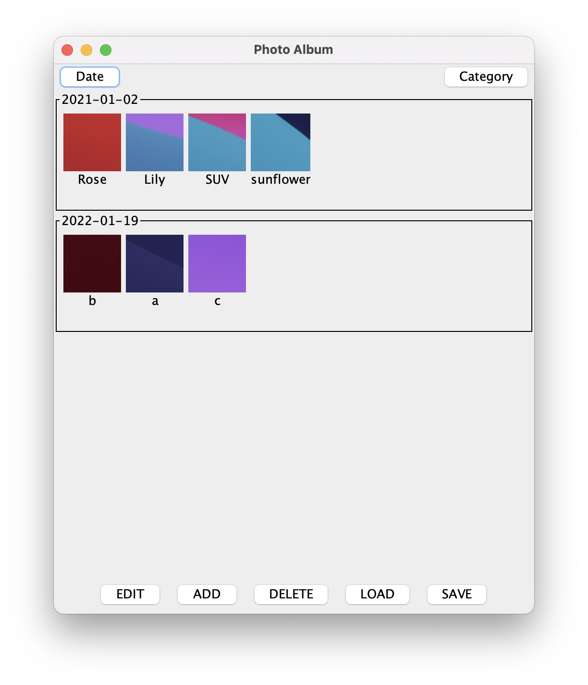
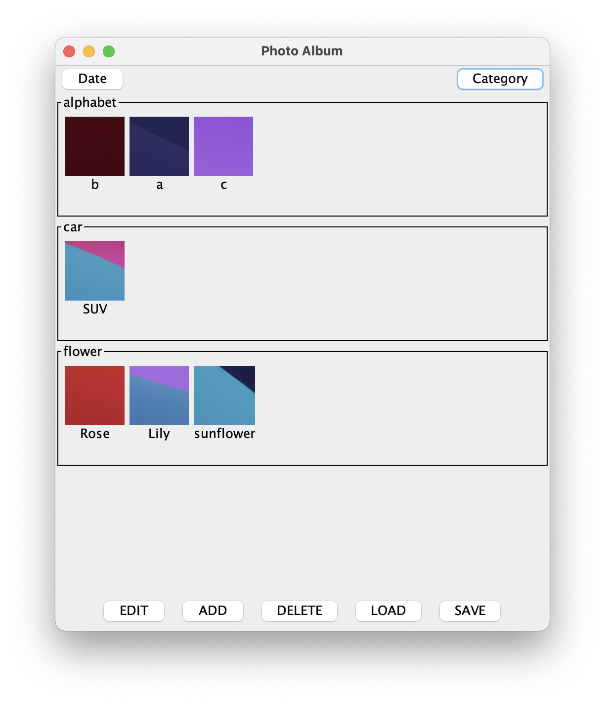
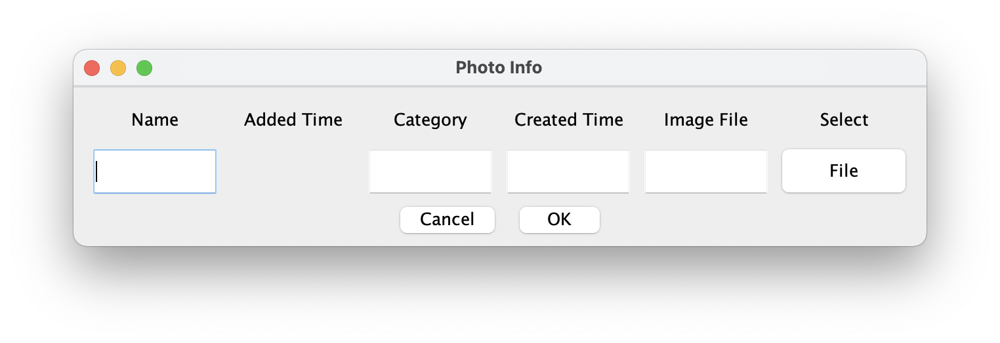
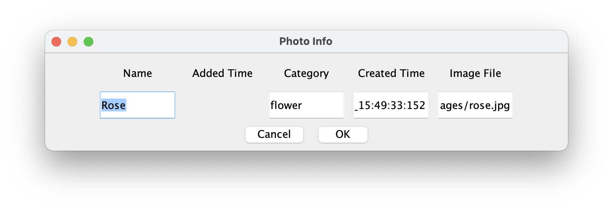

# Photo Album Manager

* This is a simple photo album management program developed with java.  
* This project was done for studying java class, GUI and event handling.

# Functionalities

* It load images list from "/images/database.data" and get image file from "/images".
* You can sort images by **Date** or **Category**.

* **DELETE** : delete image from the window 
* **LOAD** : load data from database.data and refresh the window.
* **SAVE** : save current state at database.data after modifications.

* **ADD** : read new images from "/images" and show on the program window. 

* **EDIT** : edit existing photo's information.  

* **All photo data are saved at "images/database.data".**  
* **String format of "created Time" should be like "yyyy-MM-dd_HH:mm:ss:SSS" ex) 2021-01-02_15:49:33:155.**
